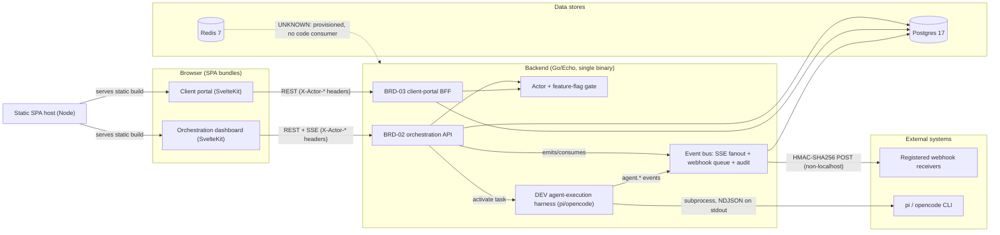

# Architecture

> As-built baseline for the agent-orchestrator platform, captured by static
> reads + Git only (no builds, generators, or code execution). Unknowns are
> marked **UNKNOWN** rather than guessed. This is the architecture-impact
> `init` proposal: it becomes **approved architecture only when merged to the
> default branch (`main`)**. Until then it is a candidate.

## System

## Components

| ID | Kind | Domain | Responsibility | Owned paths | Public contracts / trust boundaries | Allowed outgoing dependencies |
|---|---|---|---|---|---|---|
| `orchestration-ui` | UI | product (orchestration) | Internal orchestration dashboard: board, gates, decomposition, webhooks, live SSE event feed. Browser bundle. | `frontend/src/routes/orchestration/**`, `frontend/src/routes/+layout.svelte`, `frontend/src/routes/+page.svelte`, `frontend/src/lib/api/**` (shared TS API/SSE client — also used by `client-portal-ui`), `frontend/src/lib/orchestration/**` | Consumes BRD-02 REST + SSE; reads `VITE_FF_ENABLE_PLATFORM_ORCHESTRATION`. Trust boundary: browser → backend over `X-Actor-ID` / `X-Actor-Role` headers. | `orchestration-api`, `frontend-shell` |
| `client-portal-ui` | UI | client-portal | Client-facing portal: portfolio, project detail, approval inbox/decide, search. Browser bundle. | `frontend/src/routes/client-portal/**`, `frontend/src/lib/client-portal/**` | Consumes BRD-03 REST; reads `VITE_FF_ENABLE_CLIENT_PORTAL`. Trust boundary: browser → backend over `X-Actor-*` headers; client principal asserted by header. | `client-portal-bff`, `frontend-shell` |
| `frontend-shell` | service | product | Static SPA host + build pipeline. Node file server (`server.js`) serves the SvelteKit `build/`; Vite/SvelteKit build config. | `frontend/server.js`, `frontend/Dockerfile`, `frontend/svelte.config.js`, `frontend/vite.config.ts`, `frontend/vitest.config.ts`, `frontend/package.json`, `frontend/pnpm-lock.yaml`, `frontend/tsconfig.json`, `frontend/static/**`, `frontend/src/app.html`, `frontend/src/app.d.ts`, `frontend/src/lib/index.ts`, `frontend/src/lib/assets/**`, `frontend/src/test-utils/**`, `frontend/src/vitest-setup.ts` | Serves static assets on `:5173`; no server logic. | none (serves files) |
| `orchestration-api` | service | orchestration | BRD-02 platform-native orchestration pipeline: project/task CRUD, task dependencies, task + phase gates, decomposition proposals, webhook registration, handoff evidence, SSE stream, health/ready/live. Hosts the shared pgx `repository.Pool`. | `backend/main.go` (process entry, DI wiring, `runMigrations`), `backend/internal/handler/handlers.go`, `backend/internal/service/orchestration.go`, `backend/internal/repository/project.go`, `backend/internal/repository/task.go`, `backend/internal/repository/gate.go`, `backend/internal/repository/decomposition.go`, `backend/internal/repository/webhook.go`, `backend/internal/models/models.go`, `backend/main_test.go`, `backend/internal/handler/handlers_test.go`, `backend/internal/repository/task_cycle_test.go`, `backend/Dockerfile`, `backend/go.mod`, `backend/go.sum` | REST contract: `contracts/openapi.yaml` (project/task/gate/decomposition/webhook/handoff). SSE: `GET /projects/:projectId/events/stream` (`Last-Event-ID` catch-up, ≤50 clients/project). Phase-gate advancement requires `human` role. | `postgres`, `event-bus`, `auth-gate`, `agent-harness-dev` (when `agent-harness` flag on) |
| `client-portal-bff` | service | client-portal | BRD-03 backend-for-frontend: principal-scoped reads (portfolio, project detail, approval inbox, search) + approval decision. Fail-closed access; strips forbidden content from search snippets; observability metrics/logger. | `backend/internal/handler/client_portal.go`, `backend/internal/service/client_portal.go`, `backend/internal/repository/client_portal_repo.go`, `backend/internal/repository/comment.go`, `backend/internal/util/client_portal.go`, `backend/internal/models/client_portal.go`, `backend/internal/observability/metrics.go`, `backend/internal/observability/logger.go`, `backend/internal/handler/client_portal_*test.go`, `backend/internal/service/client_portal_*test.go`, `backend/internal/repository/client_portal_repo_test.go`, `backend/internal/util/client_portal_test.go`, `backend/internal/observability/observability_test.go` | REST: `GET/POST /client-portal/*` (portfolio, projects/:id, approvals, approvals/:id/decide, search). Trust boundary: client principal → BFF → reads from shared Postgres. Note: SSE `/client-portal/stream` and comment CRUD routes are **commented out** (FR-03-055 / BRD-03 Phase-1 scope) though the service code exists. | `postgres`, `auth-gate` (imports shared `repository.Pool` from `orchestration-api`) |
| `auth-gate` | service | platform | Cross-cutting Echo middleware: extracts/validates actor identity (`X-Actor-ID`) and role (`human`/`layer_a`/`layer_b`/`system`, fail-closed), feature-flag gating (`FF_ENABLE_*` → `platform-orchestration` / `client-portal` / `agent-harness` etc.), emits `auth.mutation.denied` audit events. | `backend/internal/middleware/auth.go` | Header-based actor assertion; role enum. **UNKNOWN / trust note: identity is asserted by header with no token verification** — the OpenAPI declares `BearerAuth` and the frontend sends `Authorization: Bearer`, but the backend never verifies a bearer token; there is no auth provider. | `event-bus` (auth-denied audit via injected emitter), `postgres` (via injected `InsertAuthDeniedEvent`) |
| `event-bus` | service | orchestration | Canonical 11-field event envelope (`v1alpha`): in-process SSE fanout, DB-backed webhook delivery queue + background retry worker (exponential backoff, HMAC-SHA256 signing), audit-event emission helper. | `backend/internal/event/fanout.go`, `backend/internal/event/audit.go`, `backend/internal/event/webhook_test.go`, `backend/internal/event/audit_test.go` | Event contract: `contracts/events.md` (envelope + topic registry, SSE wire format, webhook delivery + retry spec). Trust boundary: webhook signing enforced for non-localhost URLs; localhost exempt. | `postgres` (delivery queue + audit), `webhook-egress` |
| `agent-harness-dev` | service | orchestration | DEV agent-execution harness adapter: turns an active task into a real worker process and streams its lifecycle. pi primary / opencode fallback, selected from `PATH`. Concurrency cap + per-task timeout; maps worker outcome → `CompleteTask` / `BlockTask` + `agent.activated`/`idle`/`blocked`. Gated by `agent-harness`. | `backend/internal/service/harness.go`, `backend/internal/service/harness_dev.go`, `backend/internal/service/harness_test.go`, `backend/internal/service/testdata/pi_headless_fixture.json`, `backend/internal/service/orchestration_service_test.go` | Internal `Harness` interface (`Spawn`/`Runtime`), intentionally backend-agnostic so the Phase-F provider-SDK-native backend can replace it. Writes session dirs under `<workspace>/.agent-orchestrator/sessions` (or OS temp). | `agent-runtime-dev` (subprocess), `event-bus` (via task service), filesystem |
| `postgres` | store | platform | Postgres 17 — the only datastore with code consumers (pgx/v5 pool). Append-only `audit_events`; project-scoped orchestration tables; DB-backed webhook delivery queue; client-portal projections; comments; `feature_flags`; `sse_clients`. | Schema reference: `backend/db/001_brd02_schema.sql`; **runtime migrations run in code** as idempotent `CREATE TABLE IF NOT EXISTS` in `backend/main.go` (`runMigrations`). Connection string from `DATABASE_URL`. | SQL schema (tables listed above). Trust boundary: single shared DB for all backend domains (no per-domain isolation). | none |
| `redis` | store | platform | Redis 7 — **UNKNOWN: provisioned in `docker-compose.yml` (`cache` service, `:6379`) but with zero Go consumers** (no Redis client import anywhere in `backend/`). Provisioned infrastructure, no code path reads or writes it as of this baseline. | `docker-compose.yml` (`cache` service) | None consumed. | none |
| `webhook-egress` | external | integration | Arbitrary outbound HTTP webhook receivers registered by project owners; receive signed canonical-envelope POSTs for subscribed topics. | none (external) | `contracts/events.md` → Webhook Delivery Specification (`X-Webhook-Signature` HMAC-SHA256 for non-localhost; retry policy; `webhook.delivery.failed` on exhaustion). | n/a |
| `agent-runtime-dev` | external | orchestration | The agent CLI invoked as a subprocess by `agent-harness-dev`: **pi** (`pi -p --mode json`, primary) or **opencode** (`opencode run --format json`, fallback). Emits newline-delimited JSON lifecycle on stdout. | none (external; resolved from `PATH`) | NDJSON lifecycle contract documented in `backend/internal/service/harness_dev.go`. **Planned/absent: the production provider-SDK-native backend (Phase F) does not exist yet.** | n/a |

## Approval boundaries

Human (captain) approval is required before a change that does any of the
following. The architecture-impact `review` mode will return `BLOCK` for
unapproved violations of these.

- **New service, store, or external system** — e.g. introducing the Phase-F
  provider-SDK-native backend, an LLM provider SDK, a message queue, or a real
  auth provider.
- **Cross-domain write** — e.g. `client-portal-bff` writing to orchestration
  tables, or `orchestration-api` mutating client-portal projections.
- **Auth-boundary change** — anything in `auth-gate`, the actor header contract,
  or promotion of header-asserted identity to real authentication.
- **Breaking public contract** — changes to `contracts/openapi.yaml`,
  `contracts/events.md` (envelope fields, topic registry, SSE/webhook wire
  format), or the `agent-harness-dev` `Harness` interface.
- **Destructive or non-idempotent migration** — the current migrations are
  additive `CREATE TABLE IF NOT EXISTS`; any `ALTER`/`DROP`/data-backfill needs
  approval.
- **Forbidden / new top-level dependency** — adding a Go module or npm package
  (especially an LLM SDK, Redis client, or auth library) before the relevant BRD.
- **Wiring a currently-disabled surface** — enabling `client-portal` SSE
  (`/client-portal/stream`, FR-03-055), client-portal comment CRUD routes, or
  flipping any `FF_ENABLE_*`/`agent-harness` flag on in production.
- **Changes to this list.**

Only attributed human approval counts. An authoring agent cannot approve its own
boundary change.

## As-built notes and unknowns

- **Redis is unused.** `redis` is declared in `docker-compose.yml` but no backend
  code imports a Redis client. Treat any new Redis consumer as a new-store
  boundary change requiring approval. **UNKNOWN** whether it is intended for a
  future BRD or dead infrastructure.
- **Authentication is asserted, not verified.** `auth-gate` trusts `X-Actor-ID` /
  `X-Actor-Role` headers. The OpenAPI `BearerAuth` scheme and the frontend's
  `Authorization: Bearer` header are not validated by any backend code path.
  There is no identity provider today.
- **Migrations run in code.** The source of truth at runtime is the
  `runMigrations` slice in `backend/main.go` (idempotent
  `CREATE TABLE IF NOT EXISTS`). `backend/db/001_brd02_schema.sql` is the
  human-readable reference schema; the two must be kept consistent.
- **Provider-SDK-native backend is absent.** Only the DEV harness
  (`pi`/`opencode` subprocess) exists. The production provider-SDK-native backend
  is planned for Phase F and must not be depicted as built.
- **Client-portal write surface is partially dormant.** Comment CRUD and the
  client-portal SSE stream have service/handler code but their routes are
  commented out in `backend/main.go` (BRD-03 Phase-1 scope / FR-03-055 pending).
- **`docker-compose.yml` header is stale.** Its comment says "Phase 0 …
  backend/ and frontend/ are empty", but the file actually builds both
  `backend` and `frontend` and provisions `postgres` + `redis`. Doc drift, not an
  architecture change.
- **Backend Dockerfile appears incomplete.** As written it does
  `COPY *.go ./` (top-level Go files only) and would not include `backend/internal/`.
  Not validated under the static-reads-only safety rules; flagged for follow-up
  but out of scope for this baseline.
- **Shared DB pool coupling.** `repository.Pool` (defined in
  `orchestration-api`'s `repository/project.go`) is imported by
  `client-portal-bff` repos. A future refactor could lift it into a shared
  platform package; today it is a tolerated cross-domain code dependency.
