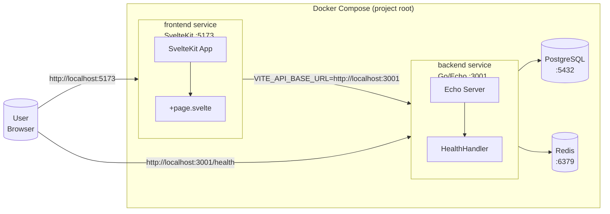
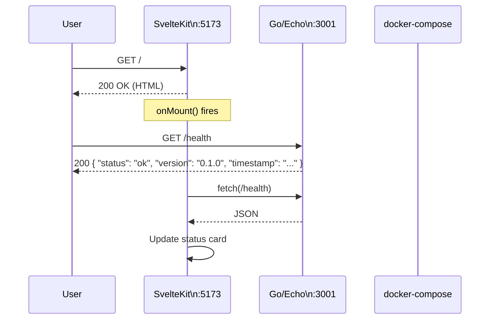
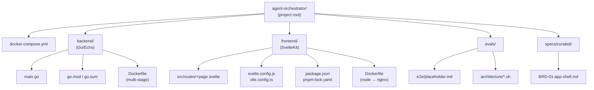
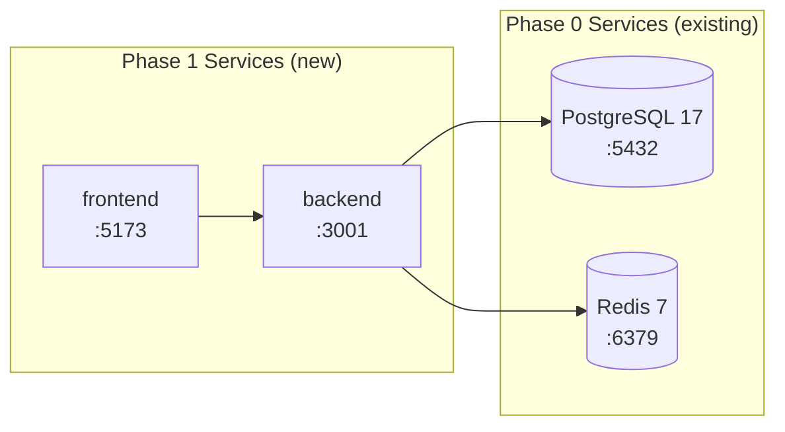

# BRD-01: Application Shell — Architecture Diagram

**Project:** agent-orchestrator
**BRD:** BRD-01 (App Shell)

---

## System Context

---

## Component Interaction Sequence

---

## Directory Structure

---

## Infrastructure Integration (Phase 0 → Phase 1)

Phase 0 docker-compose.yml defines database and cache services. BRD-01 extends this with backend and frontend services, with `depends_on` clauses ensuring healthy startup order.