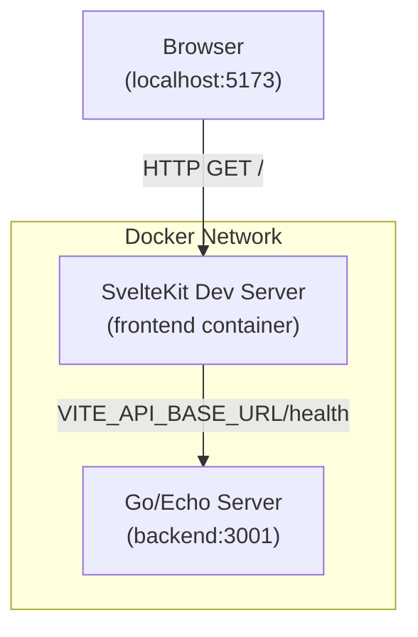

# BRD-01 — Progressive Deepening L1

**BRD:** BRD-01-app-shell  
**Stage:** 04-design-L1  
**Status:** Analyzed

---

## Component Map

```
agent-orchestrator/
├── backend/           ← Go/Echo server
│   └── main.go        ← Entry point + /health handler
├── frontend/          ← SvelteKit application
│   └── src/routes/    ← Root route page (+page.svelte)
├── docker-compose.yml ← Multi-service container orchestration
└── [env files]       ← .env, .env.example
```

---

## Component: Backend (Go/Echo)

### What

Go/Echo HTTP server exposing a `/health` endpoint on port 3001. Single binary entry point with minimal routing.

### Why

Provides a network-visible API that the frontend can call to confirm connectivity. Serves as the backend anchor for Phase 1 — no business logic, just a proof of life.

### Key Insight

The health endpoint is not just a startup check — it is the first integration point between backend and frontend. Its response shape (status, version, timestamp) sets the API "personality" for all future endpoints.

### Initial Questions Raised

| Question | Status |
|----------|--------|
| Version string — where does it come from? | Configured at build time via `-ldflags` |
| Response format — is it always JSON? | Yes, Echo JSON marshals by default |
| Error cases — what does the endpoint return if server is up but something is wrong? | Currently always returns `{ status: "ok" }` — no error path defined in Phase 1 |
| CORS — does /health need CORS headers? | Unresolved — browser may call it directly; see NFR gap |

### L1 Summary

```
┌─────────────────────────────────┐
│  Go/Echo Server                 │
│  e.Start(":3001")               │
│  GET /health  →  { ok/version }  │
└─────────────────────────────────┘
```

---

## Component: Frontend (SvelteKit)

### What

Single-page SvelteKit application at the root route. Renders in browser and calls backend health endpoint to confirm connectivity. Uses Vite dev server with `VITE_API_BASE_URL` for API base.

### Why

Confirms the UI is connected to the backend. Minimal Phase 1 landing page — no routing complexity, no auth, no state management beyond API call result.

### Key Insight

The frontend is intentionally minimal — its only job is to prove it's connected to the backend and render the returned JSON. Any feature creep (navigation, state, components) is out of Phase 1 scope.

### Initial Questions Raised

| Question | Status |
|----------|--------|
| What does the page actually render? | Unspecific — "confirms connection" |
| Error state if backend unreachable? | Not defined — likely shows raw error |
| Does this use SSR or client-side only? | SvelteKit default SSR; Phase 1 likely client-side |
| Hot reload configuration in Docker? | Dev server runs in container |

### L1 Summary

```
┌────────────────────────────────────────┐
│  SvelteKit App                         │
│  src/routes/+page.svelte               │
│  calls VITE_API_BASE_URL/health        │
│  renders { status, version, timestamp }│
└────────────────────────────────────────┘
```

---

## Component: Docker Compose

### What

Multi-service Docker Compose file that builds and starts backend and frontend containers with port forwarding and dependency ordering.

### Why

Provides a reproducible local development environment that mirrors CI. Enables running the full stack without installing Go or Node directly on the host.

### Key Insight

Docker Compose is the integration layer — it connects the two services on the same network and wires up their environment variables. The `depends_on` directive establishes startup ordering.

### Initial Questions Raised

| Question | Status |
|----------|--------|
| Network mode — host or bridge? | Default bridge (consistent with local dev) |
| Volume mounts for hot reload? | Needed for frontend dev; optional for backend |
| Build context for each service? | Each service has its own Dockerfile in its directory |
| Environment variable injection? | Via `environment:` block in docker-compose.yml |

### L1 Summary

```
┌─────────────────────────────────────────────┐
│  docker-compose.yml                         │
│  backend: build ./backend, port 3001:3001   │
│  frontend: build ./frontend, port 5173:5173 │
│  depends_on: [backend] on frontend          │
└─────────────────────────────────────────────┘
```

---

## Architecture Diagram (Mermaid)



---

## Primary Data Flows

### Happy Path: Health Check

```
1. User opens browser → http://localhost:5173
2. SvelteKit +page.svelte mounts
3. Component calls fetch(VITE_API_BASE_URL/health)
4. Backend Echo receives GET /health
5. Backend returns 200 + JSON { status: "ok", version: "0.1.0", timestamp: "..." }
6. Frontend component renders response data
```

### Error Path: Backend Unreachable

```
1. User opens browser → http://localhost:5173
2. SvelteKit +page.svelte mounts
3. Component calls fetch(VITE_API_BASE_URL/health)
4. Request times out or ECONNREFUSED (5s default fetch timeout in browser)
5. Frontend renders error state (catch block)
```

---

## Basic Error Scenarios

| Scenario | Detection | Recovery |
|----------|-----------|----------|
| Backend port not bound yet | Frontend fetch fails with ECONNREFUSED | Retry or show error |
| Backend container not started | Frontend fetch times out | Refresh page; restart container |
| Docker daemon not running | `docker-compose up` throws connection error | Check Docker status |
| Port 3001 conflict on host | Docker Compose fails to bind port | Change host process using 3001 or override port |
| Frontend build failure | `pnpm build` exits non-zero | Check npm logs |

---

## ADR Coverage Summary

| Decision | Section | Status |
|----------|---------|--------|
| Port 3001 fixed | ADR-01-001 | Proposed |
| Docker startup ordering | ADR-01-002 | Proposed |
| Echo version policy | ADR-01-003 | Proposed |

---

## Open Items Before L2

| Item | Owner | Blocking Phase 2? |
|------|-------|-------------------|
| CORS headers on /health | developer | No |
| Version string injection via build flags | developer | No |
| Frontend error state rendering spec | developer | No |
| Health check timeout value | developer | No |
| Docker volume mounts for hot reload | developer | No |

---

*L1 design complete*  
*Next: Stage 05 design L2 (edge cases + failure modes)*
